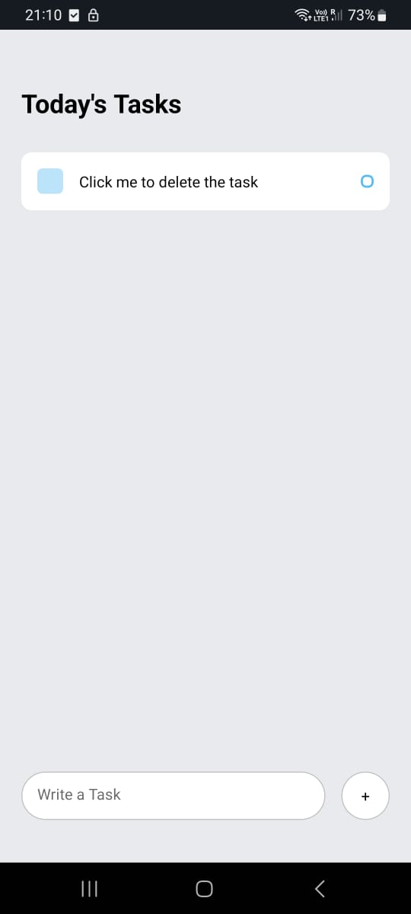

# To-Do App - React Native


<center>

</center>
  

A simple To-Do App built using React Native. This app allows you to create, manage, and organize your daily tasks and to-dos efficiently.

  

## Features

  

-  **Task Management**: Add and remove tasks easily

-  **Priority Levels**: The recently added task will be on the top as a priority

-  **User-Friendly Interface**: Minimalist To Do App, No fuss

-  **Cross-Platform**: Works on both iOS and Android.

  

## App Working

  


  

## Installation

  

1. Clone this repository.

```

git clone https://github.com/gtgkartik/To-Do-App-React-Native.git

```

2. Install the required dependencies

```

cd To-Do-App-React-Native
npm install

```
3. Start the development server.
```

npm start

``` 
## Contributing
We welcome contributions from the open-source community. If you'd like to contribute to this project, please follow these steps:

1.  Fork the repository.
2.  Create a new branch for your feature or bug fix.
3.  Make your changes and test them.
4.  Submit a pull request with a clear description of your changes.

## License

This project is licensed under the [MIT License](https://github.com/gtgkartik/To-Do-App-React-Native/blob/master/LICENSE).

## Contact

If you have any questions or want to get in touch, feel free to reach out to [Your Name] at [[gtgkartik@gmail.com](mailto:gtgkartik@gmail.com)].
